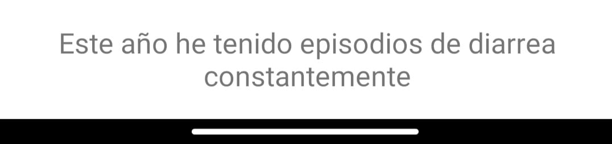

# app_LSM

## 📘 Tabla de Contenidoss
1. [Descripción](#descripción)
2. [Características](#características)
3. [Requisitos Previos](#requisitos-previos)
4. [Instalación](#instalación)
5. [Uso](#uso)
6. [Contribuir](#contribuir)
7. [Licencia](#licencia)
8. [Contacto](#contacto)

## 📃 Descripción

Esta aplicación fue desarrollada con el propósito de explorar la posible interpretación de la lengua de señas mexicana en el contexto de una consulta médica. Las señas detectadas corresponden a una lista de palabras específicas utilizadas para interpretar el dolor en términos de temporalidad, localización e intensidad.

## 📚 Características
- **Interfaz Sencilla**: Diseño fácil e intuitivo con una única vista principal.
- **Barra de Progreso**: Cuenta con una barra de progreso para ir capturando los 3 tipos de señas para poder formar la frase (temporalidad, localización/síntomas e intensidad)
  
  
  
- **Captura de Imágenes**: Incluye dos botones para controlar la captura de imágenes:
    - **Iniciar Captura**: Este botón inicia la captura de imágenes desde la cámara.
      
    - **Finalizar Captura**: Este botón detiene la captura de imágenes.
      
- **Traducción Contextual**: Cuadro de texto que muestra la frase generada con las señas detectadas. 
  
- **Señas que detecta**:
  - Temporalidad: hoy, ayer, día, mes, año, a veces, semana, ayer en la noche, ahora, año pasado, aún, antier. 
  - Localización/Síntomas: dolor de cabeza, gripe, dolor de pecho, estómago, garganta, apéndice, alergia, flemas, vómito, diarrea, mareo, tos. 
  - Intensidad: sí, constante, más o menos, grave, no, débil.

## ✏️ Requisitos Previos

- Android Studio 14.0
- JDK 34.0.0
- Emulador o dispositivo físico con Android
- Tener corriendo el servidor: 
  ```sh
    git clone https://github.com/rosaainz/lsm_server.git
    python3 src/app.py
    ```

## ⚙️ Instalación

1. Clona este repositorio:
    ```sh
    git clone https://github.com/rosaainz/app_LSM.git
    ```

2. Abre el proyecto en Android Studio:
    ```sh
    File -> Open -> Selecciona el directorio del proyecto
    ```
   
## 🤳 Uso

1. Conecta tu dispositivo Android o inicia un emulador.
2. Modifiicar la variable URL por tu dirección ip en los archivos MainActivity y network_securiry_config.xml
3. Verificar que estas en la misma red tanto para el servidor como para la app
4. Ejecuta la aplicación:
    ```sh
    Run -> Run 'app'
    ```

## 🙌 Contribuir

¡Las contribuciones son bienvenidas! Para contribuir, sigue estos pasos:

1. Haz un fork del proyecto.
2. Crea una nueva rama (`git checkout -b feature/nueva-funcionalidad`).
3. Realiza los cambios necesarios y haz un commit (`git commit -am 'Añade nueva funcionalidad'`).
4. Haz push a la rama (`git push origin feature/nueva-funcionalidad`).
5. Abre un Pull Request.

## ⚖️ Licencia

Este proyecto está licenciado bajo la Licencia MIT. Consulta el archivo [LICENSE](LICENSE) para más detalles.

## 🐚 Contacto

Si tienes alguna pregunta o sugerencia, por favor escribeme a través de www.linkedin.com/in/rosa-sainz-0b0b19212.
